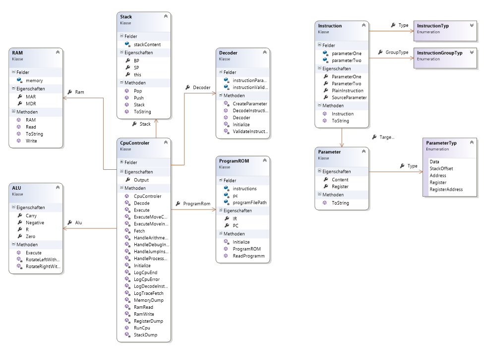

# CpuSimulator

Simple CPU Simulator (Assembler like Language) implemented with C# 

## Architecture



## Sample Program

```
TRACE_FETCH
TRACE_DECODE
MOV @254, #1071
MOV @255, #1029 
MOV B, @254       
MOV C, @255       
MOV D, #0
SUB B, D          //START:
JRZ #13           //Jump to SAVEC:
SUB C, D          //SOLANGE: C != 0
JRZ #9            //Jump to SAVEB:
SUB C, B		  // (c) - (b) N => b > c
JRN #4
SUB C, B          // c - b
MOV C, A          // c <-
JMP @19
SUB B, C          // b -c
MOV B, A          // b <-
JMP @10           //Jump to SOLANGE:
MOV @1, B         //SAVEB:
JMP @23           //Jump to END
MOV @1, C         //SAVEC:
MDUMP             //END: 
HALT
```
---
FH Wiener Neustadt - Master Software Architecture and Design 
Student-Project 
